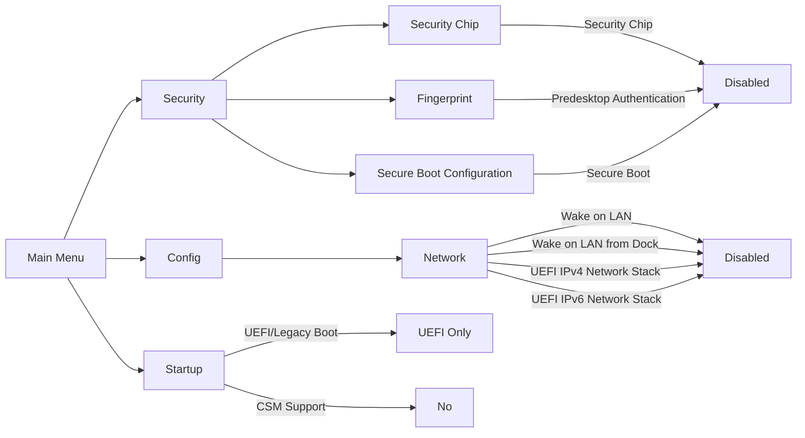
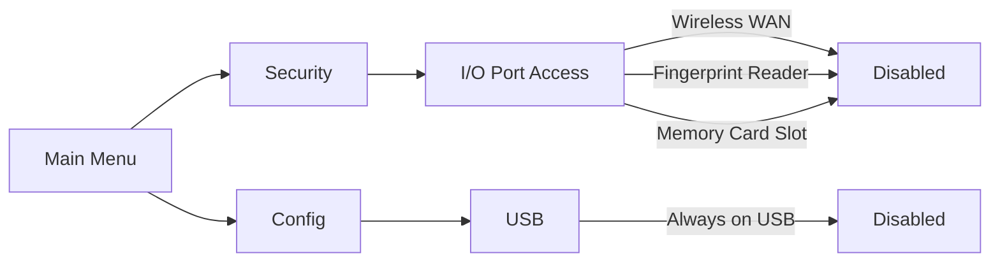
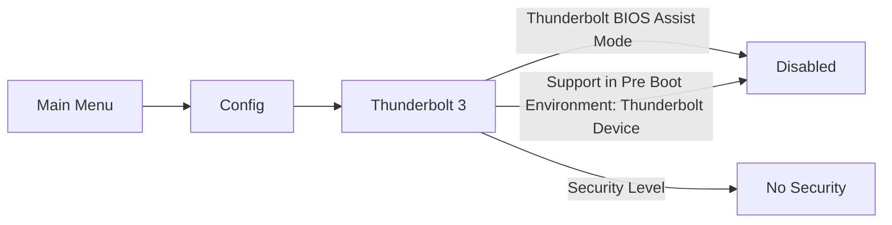
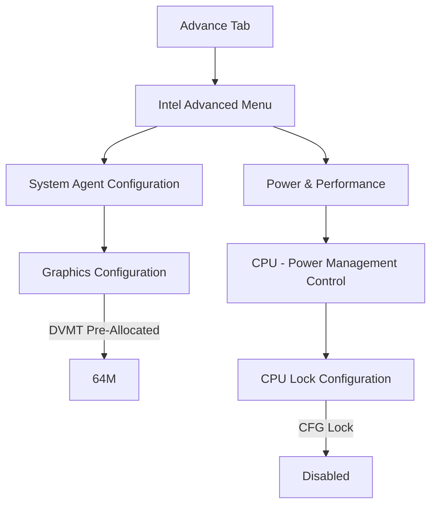
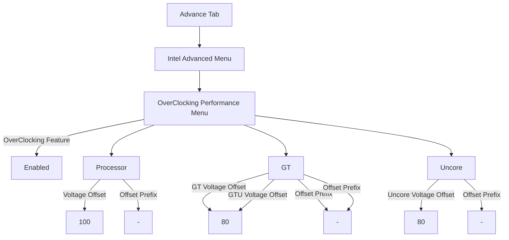
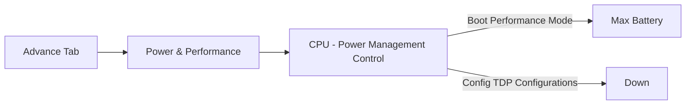

# BIOS

## Vanilla BIOS Settings

At the minimum, these BIOS settings must be made to install and run macOS without any problems:

!!! Tip
   You can also disable hardware/features you do not need to save power, some examples are:

* If you **DO NOT use Thunderbolt 3 hotplug** in macOS (don't mind shutting down the machine to connect TB3 devices), this will drastically lower power consumption:

* If you **DO use Thunderbolt 3 hotplug in macOS** (at the expense of idle power consumption):

## Modding the BIOS

!!! Danger
    As of of July 16th, 2021: the BIOS mod will break TPM. Hence, Windows 11 will not work. Consider this if you wish to proceed.  

A modded BIOS will allow for more optimizations to be made for macOS and will overall make your hackintosh better. I am a BIOS modding novice myself, but with these instructions, I was able to mod my x1c6 BIOS in less than one hour. I fully recommend doing this for all who think themselves capable. Furthermore, the default `config.plist` for this repository is meant to accommodate a modded BIOS with appropriate settings. If you cannot mod your BIOS or is unwilling to do so, use `config_unmoddedBIOS.plist`.

[SPI Programmer CH341a and SOIC8 connector](https://www.amazon.com/Organizer-Socket-Adpter-Programmer-CH341A/dp/B07R5LPTYM) are needed.

Here are the steps to mod your BIOS (credits to `paranoidbashthot` and `\x`). Attempt this at your own risk.

1. Refer to [digmorepaka/thinkpad-firnware-patches](https://github.com/digmorepaka/thinkpad-firmware-patches).
2. Use `xx_80_patches-v*.txt`, I commented out WWAN patches since I do not need it.
3. [@notthebee](https://github.com/notthebee) also has a useful video to follow: https://www.youtube.com/watch?v=ce7kqUEccUM
4. Remember to **dump the vanilla twice and use `diff` to make sure things were dumped properly**, store this backup somewhere safe.
5. Confirmed working `BIOS-v1.45`, I cannot be sure about other BIOS versions. Though they will most likely work as well.
6. The modded BIOS does not need to be signed by `thinkpad-eufi-sign`. Just **remember to replace 4C 4E 56 42 42 53 45 43 FB with 4C 4E 56 42 42 53 45 43 FF on the patched BIOS.**
   - The BIOS chip is located above the CPU, under the sticker shield:   

7. Your BIOS chip may not be made by Winbond, but by Macronix instead. In that case, add the argument `-c MX25L12835F/MX25L12845E/MX25L12865E` to `flashrom`. See [Issue #116](https://github.com/tylernguyen/x1c6-hackintosh/issues/116#issuecomment-778654320)
   - Successfully modding your BIOS will reveal the `Advance Menu` tab.

   
 

8. It goes without saying, after doing this, do not update your BIOS unless you want to do this again.

## Modded BIOS Settings
The following are further optimization settings that can be figured once your BIOS is modded.

* These settings are universally recommended optimizations for your hackintosh:

* I also recommend undervolting your machine regarless of your usage, the following are stable settings for my x1c6 with `i7-8650U`, verified by stress testing with `Prime95` and `Heaven Benchmark`, your may be worse or better, please do your own testing. In addition, I suggest you repaste your machine with an aftermarket thermal paste for lower temps and a better undervolt.

* The following settings depend on your own personal preference:

 * If you want to optimize CPU **performance** at the cost of battery:

 * If you want to optimize **battery time** at the cost of performance:

